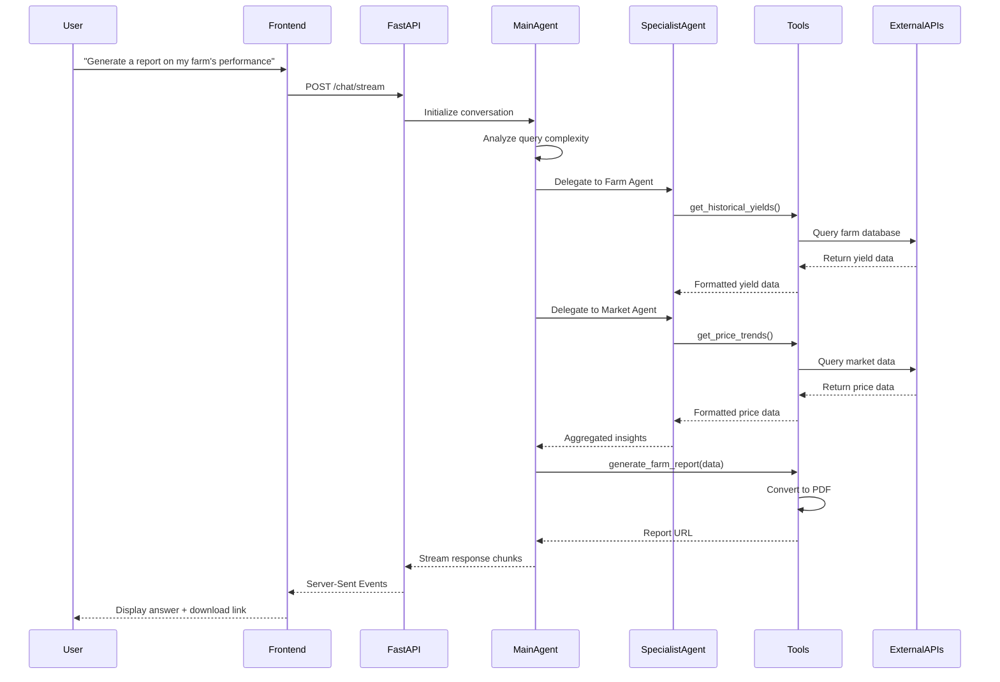

<div align="center">

# Bloom

### AI-Powered Agricultural Intelligence Platform

**Transforming complex farm data into conversational insights**

<br/>


[](https://opensource.org/licenses/MIT)
[](https://cloud.google.com/run)

</div>

---

## What is Bloom?

Bloom is an **intelligent agricultural platform** that bridges the gap between complex farm data and actionable insights. Rather than being a traditional assistant or dashboard, Bloom is a **conversational intelligence layer** that sits on top of your farm's data ecosystem, making information accessible through natural language.

Think of Bloom as your farm's **data interpreter** - it understands your questions, analyzes multiple data sources simultaneously, and presents insights in the format that makes the most sense: whether that's a simple answer, a visual chart, a map, or a comprehensive report.

## The Problem

Modern agriculture generates enormous amounts of data:
- Satellite imagery tracking crop health
- Weather patterns and forecasts
- Soil composition and moisture levels
- Historical yield data
- Market prices and trends
- Financial records and expenses

**The challenge?** This data is typically locked away in complex dashboards, spreadsheets, and technical interfaces designed for data scientists, not farmers. A smallholder farmer in Kenya shouldn't need a degree in data analytics to understand when to irrigate their crops or which variety to plant next season.

Traditional agricultural dashboards work well for large commercial operations with dedicated analysts, but they fail the majority of the world's farmers who need quick, clear answers to specific questions.

## The Solution

Bloom reimagines how farmers interact with their data by providing:

** Natural Language Interface**  
Ask questions the way you think: "Should I irrigate today?" or "What's my expected profit from maize this season?"

** Multi-Agent Intelligence**  
A team of specialized AI agents powered by Google Gemini work together to analyze your data from multiple angles - planning, monitoring, and market analysis happen simultaneously.

** Adaptive Visualizations**  
Bloom doesn't just give you text answers. It automatically generates the right visualization for your question - maps for spatial data, charts for trends, tables for comparisons.

** Real-World Application**  
The example implementation uses **Njoro Agri-Hub**, a real farm location in Nakuru County, Kenya (coordinates: -0.3667, 35.9333), demonstrating Bloom's applicability to actual agricultural operations in Africa.

## Key Capabilities

| Feature | Description |
|---------|-------------|
| **Natural Language Queries** | Ask questions in plain language and receive contextual answers tailored to your farm's data |
| **Multi-Agent Orchestration** | Specialized AI agents collaborate to handle complex queries requiring multiple data sources |
| **Dynamic Widget Generation** | Automatically creates appropriate visualizations (maps, charts, tables) based on query context |
| **Semantic Search** | Vector embeddings enable intelligent search across historical farm records and documents |
| **Real-Time Data Integration** | Combines satellite imagery, weather forecasts, and web search for current information |
| **Professional Report Generation** | Creates comprehensive PDF reports with tables, charts, and analysis on demand |
| **Contextual PDF Analysis** | Upload and query agricultural documents, research papers, or previous reports |

## System Architecture

Bloom employs a sophisticated multi-layered architecture designed for scalability and intelligent data processing.

### Architecture Overview

```
┌─────────────────────────────────────────────────────────────────┐
│                         Frontend Layer                           │
│  ┌──────────────┐  ┌──────────────┐  ┌──────────────┐          │
│  │   Next.js    │  │  React 19    │  │ Tailwind CSS │          │
│  │   (SSR/CSR)  │  │  Components  │  │   Styling    │          │
│  └──────────────┘  └──────────────┘  └──────────────┘          │
│         │                  │                  │                  │
│         └──────────────────┴──────────────────┘                  │
│                            │                                     │
│                    Server-Sent Events                            │
│                            │                                     │
└────────────────────────────┼─────────────────────────────────────┘
                             │
┌────────────────────────────┼─────────────────────────────────────┐
│                    Backend Layer (FastAPI)                       │
│                            │                                     │
│  ┌─────────────────────────▼──────────────────────────┐         │
│  │         Agent Orchestration Layer                  │         │
│  │  ┌──────────────────────────────────────────────┐  │         │
│  │  │      Main Agent (bloom_main_agent)           │  │         │
│  │  │         Google Gemini 2.0 Flash              │  │         │
│  │  └──────────────────────────────────────────────┘  │         │
│  │                      │                              │         │
│  │         ┌────────────┼────────────┐                 │         │
│  │         │            │            │                 │         │
│  │  ┌──────▼─────┐ ┌───▼──────┐ ┌──▼────────┐        │         │
│  │  │  Planner   │ │   Farm   │ │  Market   │        │         │
│  │  │   Agent    │ │  Agent   │ │  Agent    │        │         │
│  │  └────────────┘ └──────────┘ └───────────┘        │         │
│  └─────────────────────────────────────────────────────┘         │
│                            │                                     │
│  ┌─────────────────────────▼──────────────────────────┐         │
│  │              Tool Execution Layer                  │         │
│  │  ┌──────────┐ ┌──────────┐ ┌──────────┐          │         │
│  │  │  Earth   │ │ Weather  │ │  Market  │          │         │
│  │  │  Engine  │ │   Tool   │ │   Tool   │          │         │
│  │  └──────────┘ └──────────┘ └──────────┘          │         │
│  │  ┌──────────┐ ┌──────────┐ ┌──────────┐          │         │
│  │  │  Vector  │ │  Search  │ │  Report  │          │         │
│  │  │  Search  │ │   Tool   │ │   Tool   │          │         │
│  │  └──────────┘ └──────────┘ └──────────┘          │         │
│  └─────────────────────────────────────────────────────┘         │
└──────────────────────────────┬───────────────────────────────────┘
                               │
┌──────────────────────────────┼───────────────────────────────────┐
│                      Data & Services Layer                       │
│  ┌──────────────┐  ┌──────────────┐  ┌──────────────┐          │
│  │   Vertex AI  │  │ Google Earth │  │   Weather    │          │
│  │  Embeddings  │  │    Engine    │  │     API      │          │
│  └──────────────┘  └──────────────┘  └──────────────┘          │
│  ┌──────────────┐  ┌──────────────┐  ┌──────────────┐          │
│  │ Vector Search│  │ Google Search│  │  Farm Data   │          │
│  │    Index     │  │     API      │  │   (CSV/DB)   │          │
│  └──────────────┘  └──────────────┘  └──────────────┘          │
└──────────────────────────────────────────────────────────────────┘
```

### Data Flow: Query to Response



## How Bloom Works

### Multi-Agent Intelligence System

Bloom's intelligence comes from a coordinated team of specialized AI agents built with the **Google Agent Development Kit (ADK)**. Each agent has domain expertise and can use specific tools to accomplish its goals.

#### Agent Hierarchy

```
                    ┌─────────────────────┐
                    │  bloom_main_agent   │
                    │   (Orchestrator)    │
                    └──────────┬──────────┘
                               │
                ┌──────────────┼──────────────┐
                │              │              │
        ┌───────▼──────┐ ┌────▼─────┐ ┌─────▼──────┐
        │   Planner    │ │   Farm   │ │   Market   │
        │    Agent     │ │  Agent   │ │   Agent    │
        └──────────────┘ └──────────┘ └────────────┘
```

**Main Agent (Orchestrator)**
- Receives and interprets user queries
- Determines query complexity and required expertise
- Delegates tasks to specialist agents
- Synthesizes responses from multiple sources
- Manages conversation context and history

**Planner Agent**
- Crop selection and rotation planning
- Profitability forecasting
- Long-term strategic planning
- Resource allocation optimization

**Farm Agent**
- Real-time crop monitoring
- Weather analysis and irrigation recommendations
- Soil health assessment
- Pest and disease detection

**Market Agent**
- Price tracking and trend analysis
- Optimal selling timing recommendations
- Expense tracking and budget analysis
- Market intelligence gathering

### Tool Execution Framework

Agents interact with external systems through a structured tool-calling mechanism:

1. **Tool Declaration**: Each tool is a Python function with type hints and docstrings that describe its purpose and parameters
2. **Intent Recognition**: Gemini models analyze user queries and determine which tools are needed
3. **Function Calling**: Agents generate structured function calls with appropriate arguments
4. **Execution**: The backend executes the Python function and retrieves data
5. **Result Processing**: Agents receive results and incorporate them into their reasoning
6. **Response Generation**: Final answer is formulated using the gathered data

### Embeddings and Semantic Search

Bloom uses **Vertex AI Embeddings** to enable intelligent search across farm data:

**Indexing Process**
```
Farm Documents → Text Chunking → Vertex AI Embeddings → Vector Search Index
```

**Query Process**
```
User Question → Embedding Generation → Vector Similarity Search → Relevant Context
```

This allows farmers to ask questions like "What did we plant in the north field last year?" without needing to remember exact dates or field IDs. The system understands semantic meaning and retrieves relevant historical records.

### Report Generation Pipeline

Bloom can generate comprehensive PDF reports through a multi-stage process:

1. **Data Collection**: Main agent delegates to specialists to gather all relevant data
2. **Content Structuring**: Agent organizes information into logical sections with markdown formatting
3. **Table Generation**: Structured data is formatted into tables with proper headers
4. **PDF Rendering**: ReportLab converts markdown to PDF with custom styling and branding
5. **Delivery**: Report is saved and a download URL is provided to the user

The system automatically handles table width constraints, text wrapping, and page breaks to ensure professional-looking reports.

## Technical Components

### Agents

| Agent | Responsibility | Key Tools |
|-------|---------------|-----------|
| **bloom_main_agent** | Query orchestration, task delegation, response synthesis | All tools (can delegate to any specialist) |
| **planner_agent** | Strategic planning, crop selection, profitability analysis | `recommend_crop`, `forecast_profitability`, `plan_rotation` |
| **farm_agent** | Real-time monitoring, weather analysis, crop health | `get_weather`, `analyze_soil_moisture`, `get_ndvi_timeseries` |
| **market_agent** | Market intelligence, pricing, financial tracking | `get_price_chart`, `track_expenses`, `recommend_sell_timing` |

### Tools

| Tool | Purpose | Data Source |
|------|---------|-------------|
| **earth_engine_tool.py** | Satellite imagery analysis, NDVI calculation, soil properties | Google Earth Engine |
| **weather_tool.py** | Current conditions and 7-day forecasts | OpenWeatherMap API |
| **market_tool.py** | Price tracking, expense analysis, inventory management | Local database + web search |
| **planner_tool.py** | Crop recommendations, profitability forecasting, rotation planning | Historical farm data + ML models |
| **vector_search_tool.py** | Semantic search across farm documents and records | Vertex AI Search |
| **search_tool.py** | Real-time web search for market prices and agricultural information | Google Search API |
| **report_tool.py** | Professional PDF report generation with tables and charts | ReportLab library |
| **widget_tool.py** | Dynamic data visualization creation | Aggregated data from other tools |

### Widgets

Bloom automatically generates interactive visualizations based on query context:

| Widget | Data Displayed | Use Case |
|--------|----------------|----------|
| **WeatherTodayWidget** | Current conditions, 7-day forecast, farming conditions | Daily planning, irrigation decisions |
| **SoilMoistureMapWidget** | Moisture levels, soil pH, texture analysis | Irrigation scheduling |
| **CropRecommendationWidget** | Recommended crops with suitability scores | Planting decisions |
| **ProfitabilityForecastWidget** | Revenue, cost, and profit projections | Financial planning |
| **GrowthTrackerWidget** | NDVI trends, growth stage analysis | Crop health monitoring |
| **PriceChartWidget** | Historical and current market prices | Selling decisions |
| **ExpenseTrackerWidget** | Cost breakdown by category | Budget management |
| **SellTimingWidget** | Optimal selling windows based on price trends | Harvest timing |
| **RotationPlanWidget** | Multi-season crop rotation schedule | Long-term planning |
| **FarmMapWidget** | Field boundaries and plot information | Spatial planning |
| **NDVITimeSeriesWidget** | Vegetation health over time | Growth monitoring |
| **SatelliteImageryWidget** | Recent satellite images with analysis | Visual field assessment |
| **InventoryStatusWidget** | Current stock levels and storage capacity | Inventory management |

### Data Sources

Bloom integrates multiple data sources to provide comprehensive insights:

**Farm-Specific Data**
- Historical yield records (CSV format in `Bloom-backend/data/`)
- Plot boundaries and field information
- Crop rotation history
- Financial records (expenses, revenue, inventory)
- Soil test results

**External Data Sources**
- **Google Earth Engine**: Sentinel-2 satellite imagery, NDVI calculations, soil property maps
- **OpenWeatherMap API**: Real-time weather conditions, 7-day forecasts, agricultural indices
- **Google Search**: Market prices, agricultural news, pest outbreak information
- **Vertex AI Search**: Semantic search index of farm documents and historical records

**Example Farm: Njoro Agri-Hub**

The demonstration uses a real farm location in Nakuru County, Kenya:
- **Location**: Njoro, Nakuru County (-0.3667°, 35.9333°)
- **Area**: 50 hectares across multiple plots
- **Crops**: Maize, wheat, potatoes, beans
- **Data Period**: 2020-2024 (5 seasons of historical data)

## Google Technologies Used

*   **Google Gemini:** The core AI model powering the agents.
*   **Vertex AI:** Used for hosting the Gemini models and for Vertex AI Search (Embeddings).
*   **Google Earth Engine:** Provides satellite imagery and geospatial data.
*   **Google Search:** For real-time web search.
*   **Google ADK (Agent Development Kit):** The framework used to build the agentic system.
*   **Google Cloud Run:** The ideal deployment target for the FastAPI backend.

## Getting Started

### Prerequisites

**Required Software**
- Python 3.9 or higher
- Node.js 18 or higher
- Google Cloud SDK
- Git

**Required API Keys**
- Google Cloud project with Vertex AI API enabled
- OpenWeatherMap API key (free tier available)
- Perplexity AI API key (for web search)

**Optional but Recommended**
- Google Earth Engine account (for satellite data)
- Vertex AI Search index (for semantic search)

### Backend Setup

1. **Clone the repository and navigate to backend:**
   ```bash
   git clone <repository-url>
   cd Bloom-backend
   ```

2. **Create and activate virtual environment:**
   ```bash
   python -m venv venv
   
   # On Windows
   venv\Scripts\activate
   
   # On macOS/Linux
   source venv/bin/activate
   ```

3. **Install dependencies:**
   ```bash
   pip install -r requirements.txt
   ```

4. **Configure environment variables:**
   
   Create a `.env` file in the `Bloom-backend` directory:
   ```env
   GOOGLE_APPLICATION_CREDENTIALS="path/to/your/service-account-key.json"
   OPEN_WEATHER_API="your_openweathermap_api_key"
   PERPLEXITY_API_KEY="your_perplexity_api_key"
   VECTOR_SEARCH_API_ENDPOINT="your_vertex_ai_search_endpoint"
   VECTOR_SEARCH_INDEX_ENDPOINT="your_index_endpoint"
   VECTOR_SEARCH_DEPLOYED_INDEX_ID="your_deployed_index_id"
   GCLOUD_PATH="path/to/gcloud"
   ```

5. **Start the backend server:**
   ```bash
   uvicorn main:app --reload --port 8000
   ```
   
   The API will be available at `http://localhost:8000`

### Frontend Setup

1. **Navigate to frontend directory:**
   ```bash
   cd bloom
   ```

2. **Install dependencies:**
   ```bash
   npm install
   ```

3. **Configure environment (if needed):**
   
   Create `.env.local` file:
   ```env
   NEXT_PUBLIC_API_URL=http://localhost:8000
   ```

4. **Start the development server:**
   ```bash
   npm run dev
   ```
   
   The application will be available at `http://localhost:3000`

### Deployment to Google Cloud Run

1. **Build the backend container:**
   ```bash
   cd Bloom-backend
   gcloud builds submit --tag gcr.io/YOUR_PROJECT_ID/bloom-backend
   ```

2. **Deploy to Cloud Run:**
   ```bash
   gcloud run deploy bloom-backend \
     --image gcr.io/YOUR_PROJECT_ID/bloom-backend \
     --platform managed \
     --region us-central1 \
     --allow-unauthenticated
   ```

3. **Deploy the frontend:**
   ```bash
   cd bloom
   npm run build
   # Deploy to your preferred hosting (Vercel, Cloud Run, etc.)
   ```

## Project Structure

```
Bloom/
├── Bloom-backend/          # FastAPI backend
│   ├── agents/             # AI agent definitions
│   │   ├── mainagent.py    # Main orchestrator agent
│   │   ├── planner.py      # Planning specialist
│   │   ├── farm.py         # Farm monitoring specialist
│   │   └── market.py       # Market intelligence specialist
│   ├── tools/              # Tool implementations
│   │   ├── earth_engine_tool.py
│   │   ├── weather_tool.py
│   │   ├── market_tool.py
│   │   ├── planner_tool.py
│   │   ├── vector_search_tool.py
│   │   ├── search_tool.py
│   │   ├── report_tool.py
│   │   └── widget_tool.py
│   ├── data/               # Farm data (CSV files)
│   ├── reports/            # Generated PDF reports
│   ├── tests/              # Unit and integration tests
│   ├── main.py             # FastAPI application
│   └── requirements.txt    # Python dependencies
│
└── bloom/                  # Next.js frontend
    ├── src/
    │   ├── app/            # Next.js app router
    │   ├── components/     # React components
    │   │   ├── widgets/    # Data visualization widgets
    │   │   ├── ChatSection.tsx
    │   │   ├── ChatInput.tsx
    │   │   └── ChatBubble.tsx
    │   └── utils/          # Utility functions
    ├── public/             # Static assets
    └── package.json        # Node dependencies
```

## License

This project is licensed under the MIT License - see the LICENSE file for details.

---

<div align="center">

### Built for the Google Cloud Run Hackathon

**Leveraging Google Cloud's AI and infrastructure to transform agriculture**

[Google Cloud Run](https://cloud.google.com/run) | [Vertex AI](https://cloud.google.com/vertex-ai) | [Google Earth Engine](https://earthengine.google.com/)

</div>