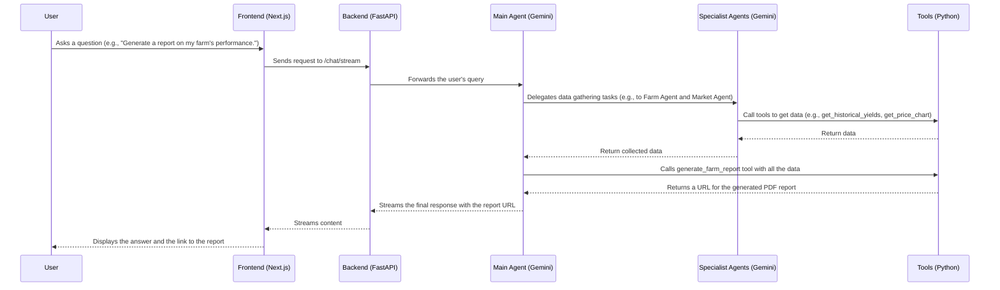

# Bloom: The AI-Powered Farming Assistant

[](https://opensource.org/licenses/MIT)
[](https://cloud.google.com/run)
[](https://github.com/your-repo/bloom#google-technologies-used)

Bloom is an advanced, agentic AI system designed to empower farmers by transforming complex agricultural data into simple, actionable insights. It provides a conversational interface to help farmers in Africa and around the world make informed decisions, moving away from complicated dashboards towards natural language queries.

## The Problem

Modern farming generates vast amounts of data from sensors, satellites, and manual records. While this data holds immense potential, it is often presented in complex dashboards and spreadsheets that are difficult for the average farmer to interpret. Farmers need a simpler, more intuitive way to understand their data and get answers to critical questions about their operations.

## The Solution

Bloom addresses this challenge by providing a multi-agent system powered by Google's Gemini models. Farmers can interact with Bloom in natural language, asking questions like "What's the weather forecast for this week?" or "Which crop should I plant in the North Field?". Bloom's specialist agents collaborate to analyze data, perform tasks, and provide clear, concise answers, along with intuitive data visualizations.

The example farm used in this project, **Njoro Agri-Hub**, is a real location in Nakuru County, Kenya, demonstrating Bloom's applicability to real-world scenarios.

## Key Features

*   **Conversational Interface:** Interact with your farm data using natural language.
*   **Multi-Agent System:** A team of specialized AI agents for planning, farm monitoring, and market analysis.
*   **Data Visualization:** Automatically generated widgets for weather, maps, charts, and more.
*   **Actionable Insights:** Clear recommendations for crop selection, irrigation, pest control, and selling timing.
*   **Dynamic PDF Report Generation:** Generate detailed, professional PDF reports on farm performance.
*   **Real-time Data:** Integrates with Google Earth Engine and web search for up-to-date information.

## System Architecture & Data Flow

Bloom's architecture is built around a central orchestrator agent (`bloom_main_agent`) that delegates tasks to a team of specialized agents. The frontend is a Next.js application that communicates with a FastAPI backend.



## How it Works

### The Multi-Agent System

Bloom's core is a sophisticated multi-agent system built with the **Google Agent Development Kit (ADK)**. This system is designed for complex problem-solving through collaboration between specialized AI agents.

*   **Orchestration:** The `bloom_main_agent` acts as the central orchestrator. It analyzes the user's request and determines the best course of action.
*   **Delegation:** For complex queries, the main agent breaks down the problem into smaller tasks and delegates them to the appropriate specialist agents. For example, a request for a full farm report would involve delegating data gathering to the `planner_agent`, `farm_agent`, and `market_agent`.
*   **Communication & Collaboration:** The agents communicate by passing data and results to each other. The main agent can synthesize information from multiple specialists to provide a comprehensive answer. This allows for a "divide and conquer" approach to problem-solving, where each agent contributes its expertise.

### The Tool Call System

To interact with the outside world and perform actions, the agents use a robust tool-calling system.

*   **Tools as Functions:** Each tool is a Python function with a specific purpose (e.g., `get_weather_forecast`, `generate_farm_report`).
*   **Agent-Tool Interaction:** The Gemini model is trained to understand when and how to use these tools. When an agent decides to use a tool, it generates a "function call" with the necessary arguments.
*   **Execution and Results:** The backend executes the corresponding Python function and returns the result to the agent. The agent then uses this result to continue its task or formulate a response.

### Dynamic PDF Report Generation

A key feature of Bloom is its ability to generate detailed, professional PDF reports on demand.

*   **Data Aggregation:** The `bloom_main_agent` is responsible for gathering all the necessary data for a report by delegating to the specialist agents.
*   **Content Formatting:** The main agent then formats the collected data into a comprehensive markdown string, complete with titles, sections, tables, and analysis.
*   **PDF Generation:** Finally, the agent calls the `generate_farm_report` tool, which uses the `reportlab` library to convert the markdown content into a polished PDF document.

### Agents

*   **Main Agent (`bloom_main_agent`):** The orchestrator that receives user queries, delegates tasks to specialist agents, and synthesizes the final response.
*   **Planner Agent (`planner_agent`):** Handles all planning and forecasting questions, including crop selection, profitability, and rotation.
*   **Farm Agent (`farm_agent`):** Focuses on real-time monitoring and operations, such as crop health, weather, and irrigation.
*   **Market Agent (`market_agent`):** Provides market intelligence, including pricing, selling timing, and expense tracking.

### Tools

*   **`earth_engine_tool.py`:** Integrates with Google Earth Engine to provide satellite imagery, NDVI analysis, and soil data.
*   **`market_tool.py`:** Provides functions for price tracking, expense analysis, and inventory status.
*   **`planner_tool.py`:** Includes tools for crop recommendation, profitability forecasting, and rotation planning.
*   **`report_tool.py`:** Generates detailed PDF reports from markdown content.
*   **`search_tool.py`:** A web search tool for real-time information.
*   **`vector_search_tool.py`:** Performs semantic search over farm data using Vertex AI Search.
*   **`weather_tool.py`:** Fetches current weather and forecasts from the OpenWeatherMap API.
*   **`widget_tool.py`:** Creates the data for the frontend widgets.

### Widgets

*   `WeatherTodayWidget.tsx`
*   `GrowthTrackerWidget.tsx`
*   `SoilMoistureMapWidget.tsx`
*   `CropRecommendationWidget.tsx`
*   `ProfitabilityForecastWidget.tsx`
*   `ExpenseTrackerWidget.tsx`
*   `SellTimingWidget.tsx`
*   `InventoryStatusWidget.tsx`
*   `PriceChartWidget.tsx`
*   `RotationPlanWidget.tsx`
*   `FarmMapWidget.tsx`
*   `NDVITimeSeriesWidget.tsx`
*   `SatelliteImageryWidget.tsx`

### Data

*   **Farm Data:** Historical and real-time data about the farm, including plot details, crop history, yields, and financials. The data is stored in CSV files in the `Bloom-backend/data/` directory.
*   **Satellite Data:** From Google Earth Engine for crop health and soil analysis.
*   **Weather Data:** From the OpenWeatherMap API.
*   **Web Search Data:** From Google Search for real-time market prices and other information.

### Embeddings & Vector Search

Bloom uses **Vertex AI Search** to create a semantic search engine for the farm's data. This allows farmers to ask questions in natural language and get relevant results, even if they don't use the exact keywords. The `vector_search_tool.py` handles the creation of embeddings and querying the vector search index.

## Google Technologies Used

*   **Google Gemini:** The core AI model powering the agents.
*   **Vertex AI:** Used for hosting the Gemini models and for Vertex AI Search (Embeddings).
*   **Google Earth Engine:** Provides satellite imagery and geospatial data.
*   **Google Search:** For real-time web search.
*   **Google ADK (Agent Development Kit):** The framework used to build the agentic system.
*   **Google Cloud Run:** The ideal deployment target for the FastAPI backend.

## Getting Started

### Prerequisites

*   Python 3.9+
*   Node.js 18+
*   Google Cloud SDK
*   A Google Cloud project with the Vertex AI API enabled.
*   An OpenWeatherMap API key.
*   A Perplexity AI API key.

### Backend Setup

1.  **Navigate to the backend directory:**
    ```bash
    cd Bloom-backend
    ```
2.  **Create a virtual environment:**
    ```bash
    python -m venv venv
    source venv/bin/activate  # On Windows, use `venv\Scripts\activate`
    ```
3.  **Install the dependencies:**
    ```bash
    pip install -r requirements.txt
    ```
4.  **Set up your environment variables:**
    Create a `.env` file in the `Bloom-backend` directory and add the following:
    ```
    GOOGLE_APPLICATION_CREDENTIALS="path/to/your/gcp-service-account.json"
    OPEN_WEATHER_API="your_openweathermap_api_key"
    PERPLEXITY_API_KEY="your_perplexity_api_key"
    VECTOR_SEARCH_API_ENDPOINT="your_vector_search_api_endpoint"
    VECTOR_SEARCH_INDEX_ENDPOINT="your_vector_search_index_endpoint"
    VECTOR_SEARCH_DEPLOYED_INDEX_ID="your_vector_search_deployed_index_id"
    GCLOUD_PATH="path/to/your/gcloud"
    ```
5.  **Run the backend server:**
    ```bash
    uvicorn main:app --reload
    ```

### Frontend Setup

1.  **Navigate to the frontend directory:**
    ```bash
    cd bloom
    ```
2.  **Install the dependencies:**
    ```bash
    npm install
    ```
3.  **Run the frontend development server:**
    ```bash
    npm run dev
    ```

## Hackathon

This project was built for the **Google Cloud Run Hackathon**.